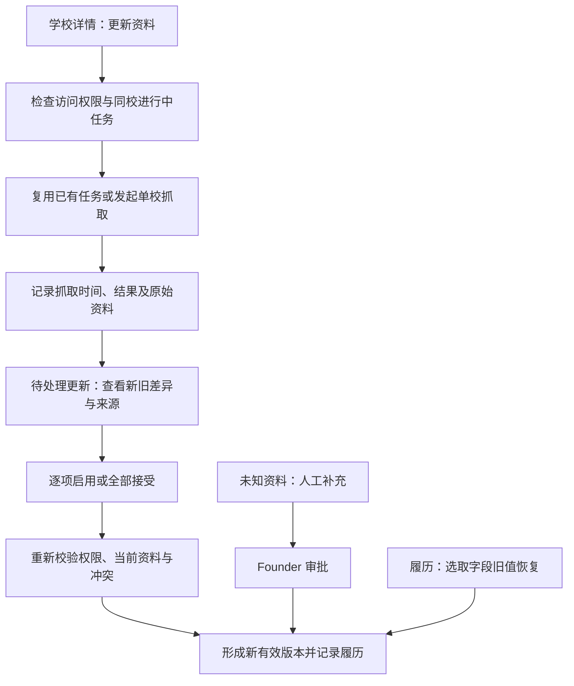

# SCH-INT-01 学校数据对接方案 V1（整体审阅稿）

整理日期：2026-09-19

状态：`draft_for_review`。业务规则已逐项确认；本次仅整合方案，不代表技术设计整体获批、代码实现、真实数据导入或上线。

业务唯一依据：[BR-051 学校需求](../../../txgj-doc/business-requirements/50-schools.zh-CN.md)，基线 `BR-BASELINE-20260919-v53`。如本文与该需求冲突，以已确认需求为准。旧设计中的 Founder-only 爬虫启用、单条招生结构等不再作为本方案实施依据。

## 1. 目标与范围

让天星教育内部用户直接在学校管理中发起单校抓取、查看差异、选择启用资料，并查看或恢复历史值。主项目使用稳定的 Schools 数据接口，爬虫覆盖率和提取质量可独立改善。

首版业务范围已确认：

- 单校手动更新；已有学校目录、同校多条招生资料。
- 逐字段启用或全部接受、空值保护、人工修正冲突保护、多人操作冲突保护。
- 未知资料手动补充及 Founder 审批。
- 抓取来源维护审批、完整更新履历、逐字段恢复旧值。
- 学校详情四块：基础资料、招生资料、待处理更新、更新履历。

批量更新、自动定时全量更新、非 K12 课程接入不纳入本次首版实施提案。阿里云是用户选择的未来部署方向，具体产品、硬件、网络和云运行配置不在本次确认范围。

## 2. 使用流程（已确认规则）



流程说明：

- 点击更新只发起抓取，抓取完成不自动启用。
- 同校任务进行中时，其他有权访问的用户看到同一个任务的进度；重复点击不新增或重启任务。任务结束后可再次抓取。
- 新招生记录先作为候选；学年、年级未知就明确标记，不自动合并到已有记录。
- 有权启用资料的用户可选取单个字段，也可全部接受可用变化；未选字段保持当前值。
- 成功、失败、无变化均记录抓取时间和结果。失败或缺失不清空旧资料。
- 恢复旧值生成新记录，不删除中间历史、不回退其他字段；来源配置的恢复仍需 Founder 审批。

排队、执行、成功/部分取得/失败等任务状态的具体编码与展示文案属于技术设计提案，不以此流程图冻结数据库状态机。

## 3. 权限矩阵（已确认）

| 操作 | 当前规则 |
| --- | --- |
| 访问学校管理 | 沿用现有访问资格；不增加无权用户或外部客户权限 |
| 发起单校抓取、查看任务进度 | 有权访问学校管理的内部用户 |
| 逐项启用或全部接受爬虫资料 | 有权访问学校管理的内部用户；无需统一转给 Founder |
| 选择历史字段值恢复 | 有权启用资料的用户；保留新履历 |
| 提交未知资料的手动补充 | 有权访问学校管理的内部用户 |
| 人工补充生效 | Founder 审批；沿用禁止自审规则 |
| 添加、修改抓取来源生效 | Founder 审批；提交资格沿用现有规则，本次未扩大 |
| 修改已有资料、合并、拆分、停用等人工治理 | 沿用已有治理权限，不因可启用爬虫结果而放宽 |

学校官网、学校资料页、招生资讯页如果作为抓取来源配置被改变，不得通过“全部接受”、逐项启用或恢复旧值绕过 Founder 审批。抓取证据中的链接不自动成为已批准来源。

禁止自审针对人工补充/治理审批；发起抓取的人可以启用自己发起的抓取结果，两者不能混用同一审批限制。

## 4. 学校字段 V1（已确认）

| 分组 | 字段 |
| --- | --- |
| 学校身份 | 系统内部编号、爬虫来源编号、教育局学校编号、注册编号、校址标识、中文名称、英文名称 |
| 基础资料 | 官网、学校资料页面地址、学段、地区、地址、电话、传真、学生性别类别、授课时间类别、资助类别、特殊教育标记 |
| 学费与住宿 | 学费说明、学费适用学年、学费来源链接；是否提供住宿（是／否／未知）、住宿说明 |
| 招生资料 | 适用学年、招生类型、招生年级、信息发布日期、申请开始日期、截止日期、申请时段说明、申请方式、所需材料、申请表链接、招生页面链接、考试日期、面试日期、第二轮面试日期、结果公布日期 |
| 来源与更新履历 | 来源网址、证据摘要、采集时间、最近检查时间、缺失项／复核原因、版本号、变更前后值、发起人、启用人、启用时间、抓取结果 |

最低建档要求：中英文名称至少一个非空；内部编号由系统生成。其他学校业务资料可暂缺并标记未知；不免除系统记录操作者、版本等责任。

注册详情、课室容量、PDF 原文、抓取评分等保留在原始资料中，不作为首版主要业务字段。暂不单列含义重复的“学校类型”。字段获确认不等于当前爬虫已能提供这些字段。

一校多条招生记录分别表达不同学年、招生类型或年级。例如“2026/27 中一招生”和“2026/27 中二至中五插班”不共用一套截止日期。未知学年不得按抓取日期推断为当前学年。

## 5. 学校识别、来源与时间（已确认）

- 系统内部编号是稳定学校身份；爬虫来源编号维护对应关系，不替代内部编号。
- 名称、教育局编号、官网、资料页共同辅助核对。首次对应确认后保存；改名、换域名、共用办学机构网站不能导致自动合并或错误关联。
- 官网用于识别和抓取；学校资料页用于核对编号、名称、校址；招生资讯页用于招生抓取，可能随学年变化。
- 每次记录实际抓取时间；适用学年、来源发布日期、抓取时间、启用时间分开。
- 沿用旧字段时保留原来源与采集时间；本次检查时间不能让旧资料看起来像刚刚抓到。

## 6. 更新与保护规则（已确认）

| 场景 | 处理 |
| --- | --- |
| 普通字段有有效新值 | 用户可逐项启用或全部接受，保存旧新值与来源 |
| 未选某字段 | 保留当前值，不记为已接受 |
| 抓取失败、新字段为空或缺失 | 保留旧值，记录未取得数据及原因；全部接受也不能清空 |
| 来源明确表示“否”等有效值 | 不等同于缺失；按真实字段值处理 |
| 爬虫新值与人工修正冲突 | 提示曾人工修改，默认保留旧值；全部接受默认跳过，可单独显式采用新值 |
| 查看后同一字段被他人改动 | 提示资料已变化，重新查看差异并决定，不沿用旧确认 |
| 新学年招生资料 | 保留为独立招生资料，不覆盖旧学年 |
| 未知资料人工补充 | 标为人工来源，Founder 审批后生效，保留提交和审批记录 |
| 恢复历史字段值 | 生成新版本及操作履历，不删除中间历史或改变其他字段 |
| 学校目录更新 | 不静默改变已有学生申请固定引用的历史版本 |

“全部接受”是接受本次符合规则的更新，不是绕过冲突、空值保护、来源审批或权限校验。跳过的字段应可辨认，不能显示为全部已启用。

## 7. 页面信息结构

四块结构及补充入口位置已确认；下表中的具体内容安排是用于审阅的展示建议。

| 区块 | 建议内容 |
| --- | --- |
| 基础资料 | 当前有效身份、联系方式、学费住宿资料；未知项旁放手动补充入口；展示来源与采集时间 |
| 招生资料 | 按学年、招生类型和年级区分记录；未知项明显标记，旧学年保留可查 |
| 待处理更新 | 爬虫新旧差异、来源及抓取时间；逐项启用/全部接受；人工补充待审批，来源变更待审批，各按权限操作 |
| 更新履历 | 抓取成功/失败/无变化、逐字段启用、人工补充及审批、恢复操作；可查看旧新值、人员、时间和来源 |

尚未冻结页面布局、列表列项、分页交互、待处理记录的忽略/关闭方式。普通资料启用与 Founder 审批必须在界面上区分，避免以“审批”一词混淆权限。

## 8. 两个项目如何对接（技术建议，待整体审阅）

建议保留 Python 爬虫为独立后台进程，天行国际拥有用户入口、权限、任务记录、学校正式数据和履历。不需将爬虫改写成 TypeScript，也不要求额外服务器。

```text
学校页面
  -> 天行国际服务端：授权、创建或复用单校任务
  -> 后台执行进程：调用 Python 爬虫的单校入口
  -> 不可变结果包：原始记录、招生记录、证据、抓取时间、缺失与错误
  -> 天行国际接入模块：验格式、验来源对应、生成候选与差异
  -> 用户启用 / Founder 审批（按操作类型）
  -> 当前有效学校版本 + 不可变履历
  -> Schools API -> 页面与 Cases
```

### 8.1 首版交付方式建议

同机部署时，采用持久化任务记录配合后台执行进程，使用按任务隔离的文件结果包交接；网页请求只提交任务，不等待爬虫结束。后台任务重启、超时和重试不得丢失任务身份或制造重复启用。

结果包采用“临时写入、完成后交付”的方式；manifest 记录版本、文件集合、数量、字节数、hash、任务标识、来源与结果摘要。每个字段的有效值、缺失和失败应可区分。未来更换为对象存储或受认证的上传接口时，业务 Schools API 不改变。

文件只是爬虫候选输入，页面不直接读文件作为正式目录。Python 不取得正式学校资料审批或直接覆盖业务表的权力。

### 8.2 单校结果与完整目录

一次任务只声明本校的更新范围；其他学校没有出现在结果里，不能解释为删除。结果包存原始事实，逐项启用生成新的业务有效版本，两者分开。

新版本必须可以追溯“哪些字段来自哪次抓取、哪次人工补充或哪次历史恢复”。不能沿用“最新原始快照覆盖整份目录”或“只套用最新一条人工修正”的规则实现当前需求。

### 8.3 版本化契约建议

旧 `crawler-handoff/v1` 的整批结构、嵌入式旧审核回执和单校单条招生表达不足以直接承载本方案。建议建立新版本交接契约，具体版本名称、JSON schema 和迁移方式在技术设计中冻结；不得悄悄改变旧版本含义。

建议输入至少明确：任务身份、稳定学校对应、来源配置版本、抓取时间、基础资料、独立招生记录列表、逐字段证据、缺失/错误及完整性描述。

爬虫评分、`auto_selected` 和包内自报用户身份均不能代替天行国际的授权或启用决定。候选完整性校验和用户业务启用分开；损坏、错误学校对应等输入不得因点击全部接受而生效。原始 warning 可作为候选供查看，不能恢复旧 Data Reviewer 或统一 Founder-only 的普通资料启用规则。

### 8.4 主项目继续开发的方式

先冻结 Schools 对外的数据及操作契约，提供覆盖多招生记录、未知值、更新差异和历史的合成样本。主项目按此开发，爬虫用适配器交付同一契约。这样无需等待全港学校覆盖完成，真实运营验收仍需实际候选包与完整数据库/页面闭环。

用户已选阿里云；当前源码中旧 `production-aws` 等模式名称不能证明阿里云可部署，也不在本次自动改名或接通。云适配另做设计和验证。

## 9. 当前实现差距与复核清单

下列为本对话前期源码检查的结果，非本次重新执行的运行验证；实现前必须重查当前工作树。

| 已有基础 | 需要补齐/对齐 |
| --- | --- |
| Python 抓取、导出及文件 hash 校验 | 稳定单校任务入口、多条招生记录、时间和字段证据的规范化输出 |
| TypeScript 旧文件校验 | 新版本输入校验、候选与启用分离，不依赖旧 Data Reviewer 回执 |
| 学校快照/修订与部分数据库读取 | 单校逐字段启用、来源审批、历史恢复、人工补充审批和当前版本组合 |
| Schools 目录与 options 查询接口 | 新字段和多招生结构、完整分页、稳定学校/版本引用 |
| 旧学校管理页面与选校页 | 四块结构、差异确认、任务进度、补充审批及履历；清理正式路径对旧文件接口的依赖 |

旧真实快照不能通过手工改 health、回执或版本号伪装成可接入输入。旧资料迁移应经过只读预检和显式映射。批次/字段完整率和学校覆盖率必须分别表达。

## 10. 尚需决定的问题（不视为已批准）

| 问题 | 建议方向或影响 |
| --- | --- |
| 不完整招生候选最低启用条件 | 必须能确认所属学校并可追溯来源；其余最低条件需单独明确，已确认“学年未知”可保存不等于任意空记录可启用 |
| 同一招生记录如何跨批次对应 | 新建内部稳定编号，来源及年级/学年辅助核对；未知值不能自动匹配，补齐学年不能悄悄合并已有记录 |
| 学校、校址、学段对应粒度 | 明确多校址/多学段如何映射，以免把教育局不同记录误合为一校 |
| 更新按钮可用条件 | 建议至少存在可用且已批准的抓取来源；无来源时提示提交来源审批，不能只凭校名猜测网站 |
| 长期未处理或已过时的候选 | 明确提醒、重新抓取和可否继续启用的规则；与已确认的“当前字段被修改”并发检查区分 |
| 恢复值是否享有人工保护 | 建议显式恢复视为人工决定，后续爬虫冲突不自动覆盖；尚未单独确认 |
| 未选/不想采用的变化 | 当前仅确认未选不生效；忽略、关闭、再次提醒等处理待设计 |
| 实际来源配置提交资格及细节 | Founder 审批已确认；不能把未知资料补充资格自动扩大为任意来源编辑资格 |

枚举、日期精度/时区、字段名、包版本、数据库表与 API、任务超时及重试等由技术方案统一给出；涉及业务含义的选项仍需确认。恢复为空值、显式删除资料等未获确认，不作为空值保护的例外自行实现。

## 11. 建议实施顺序与验收

| 步骤 | 交付与可审阅结果 | 验收重点 |
| --- | --- | --- |
| A 契约与样本 | 对齐 BR-051，冻结新版本格式、单校/招生身份和业务 API，制作合成样本 | 双语言同包校验一致；未知、失败、字段证据与多招生表达无歧义 |
| B 接入预检 | 读取候选包并输出身份核对、字段映射、差异及阻塞原因 | 不写正式目录；错误 hash/schema/任务对应/重复记录拒绝；单校包不删除其他学校 |
| C 后台及数据库 | 任务复用、候选存储、启用、人工审批、履历、字段恢复 | 同校并发只一个任务；权限重验；事务与幂等；失败回滚；历史不可变 |
| D 页面与 Cases | 学校详情四块及统一 Schools 查询 | 页面可操作；分页不漏学校；无权限拒绝；申请历史引用不变 |
| E 真实小样本联调 | 经核对的真实来源与候选，走完整用户流程 | 实际抓取时间/证据可核验；失败与无变化可见；单校实测不冒充全量验收 |

必须覆盖的核心场景：逐项启用、全部接受跳过空值及人工冲突、独立采用冲突字段、Founder 审批及禁止自审、来源更改不绕审批、同字段并发变化、重复启用、逐字段恢复、多学年并存、抓取失败保留旧值、应用/后台重启后历史仍在。

数据库相关验收使用隔离 PostgreSQL 与合成数据验证真实事务，不用 mock 结果替代；页面验收走实际本地路径。共享/生产数据变更、真实资料启用、提交推送和部署仍按对应授权分别执行。

交付失败时保留原有效版本，失败抓取不推进当前指针；已启用资料的纠正走有履历的恢复流程，不通过删除原始包或历史行回滚。后续迁移需单独提供恢复方案。

## 12. 本次整理记录

- status：`draft_for_review`。
- owner：architect。
- changed：重写本方案，整合至 v53 已确认规则，删除旧草稿中与新规则冲突的实施路线；未增加新的业务确认。
- evidence：逐项对照当前 BR-051、需求索引及本对话确认；Markdown 空白检查。
- not_run：未改产品代码、爬虫配置或数据库；未跑抓取、测试、迁移、真实审批/启用、部署、Git 提交或推送。
- risks：第 10 节仍有未决规则，旧模块设计和代码需在实施前对齐；本稿不能作为“对接已完成”的证明。
